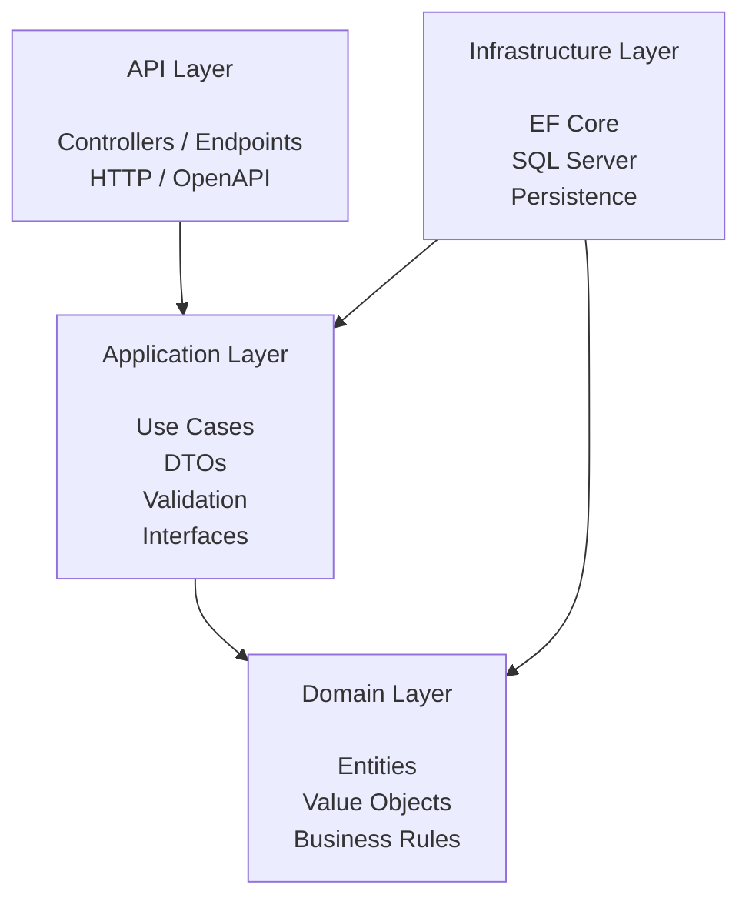
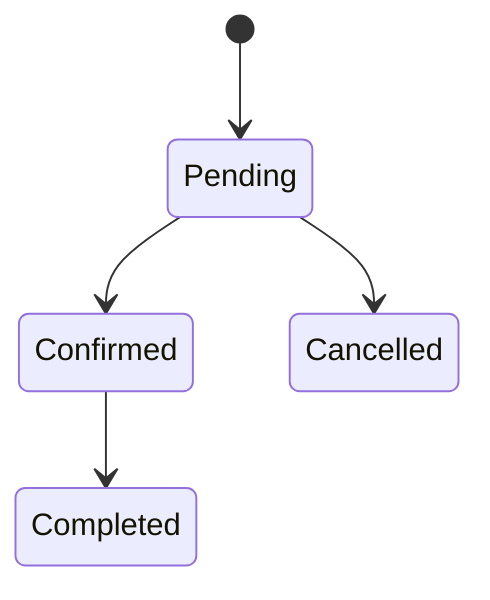
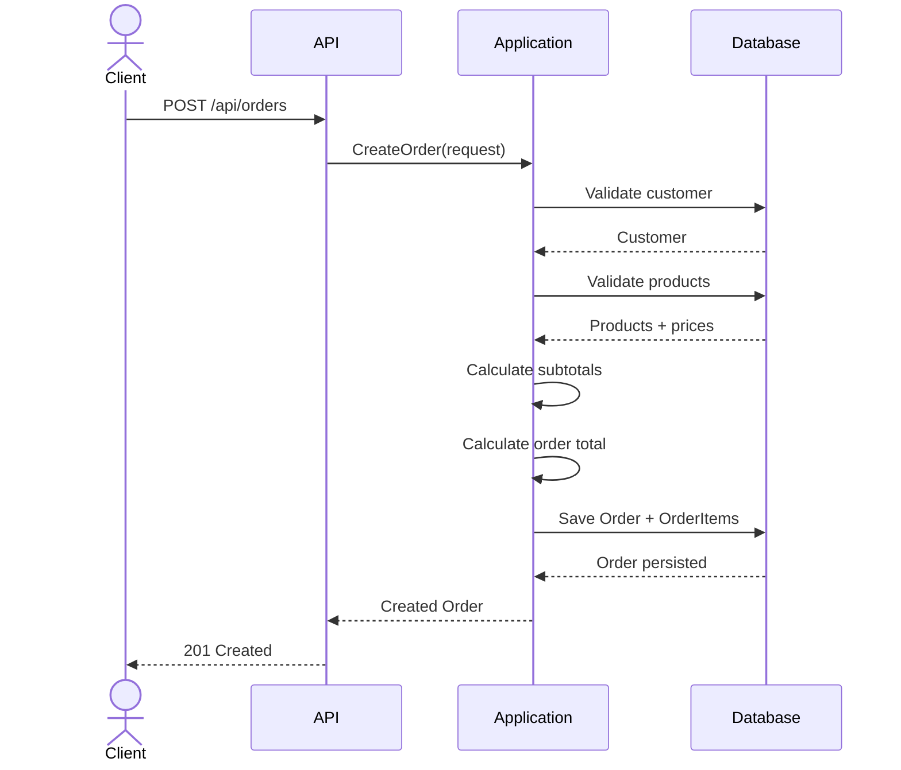
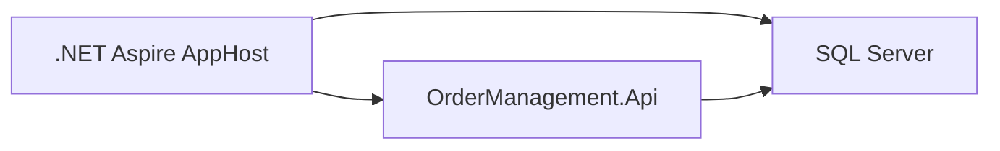
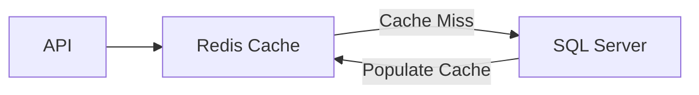
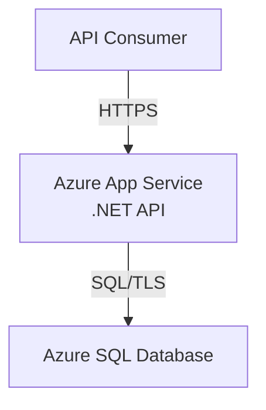
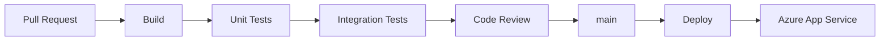
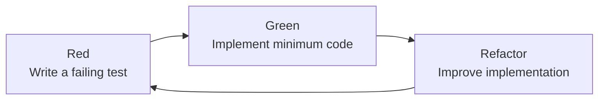

# Order Management API - Architecture

## 1. Overview

The Order Management API is a small enterprise-oriented REST API designed to demonstrate modern backend development practices using .NET.

The system provides functionality to manage customers, products, and orders while enforcing basic business rules around order creation and status transitions.

The solution is intentionally designed as a modular monolith using Clean Architecture principles.

The primary goals are:

- Maintain clear separation of concerns.
- Keep business rules independent from infrastructure and frameworks.
- Provide a testable application structure.
- Use standard .NET technologies and conventions.
- Support local development through .NET Aspire.
- Provide an automated CI/CD pipeline.
- Support deployment to Microsoft Azure.

The application is intentionally limited in scope. Authentication, authorization, payment processing, inventory management, and asynchronous messaging are outside the current scope.

### Key Decision References

See the Architecture Decision Records (ADRs) for detailed rationale on major architectural choices:
- [ADR-001: Clean Architecture](./adr/ADR-001-clean-architecture.md)
- [ADR-002: Modular Monolith](./adr/ADR-002-modular-monolith.md)
- [ADR-003: Entity Framework Core with SQL Server](./adr/ADR-003-ef-core.md)
- [ADR-004: Azure App Service and SQL Database](./adr/ADR-004-azure-hosting.md)
- [ADR-005: ASP.NET Core Controllers](./adr/ADR-005-use-aspnet-controllers.md)
- [ADR-006: Order Status Transitions](./adr/ADR-006-order-status-transitions.md)
- [ADR-007: Error Handling and HTTP Status Codes](./adr/ADR-007-error-handling.md)
- [ADR-008: Framework and Infrastructure Technology Choices](./adr/ADR-008-framework-choices.md)

## 2. Architecture Overview

The solution follows Clean Architecture principles.

The main layers are:

- Domain
- Application
- Infrastructure
- API

The dependency direction points inward toward the Domain layer.



Infrastructure implements interfaces defined by the Application layer and therefore points inward rather than becoming a dependency of the Domain layer.

## 3. Clean Architecture Principles

The following principles apply to the solution:

### Domain independence

The Domain layer must not depend on:

* ASP.NET Core
* Entity Framework Core
* Azure SDKs
* .NET Aspire
* Infrastructure implementations

The Domain layer contains business concepts and rules only.

### Application independence

The Application layer contains application use cases and contracts.

It should not depend on concrete infrastructure implementations.

### Infrastructure implementation

Infrastructure contains technical implementations such as:

* Entity Framework Core
* SQL Server persistence
* Database configuration
* External infrastructure integrations

### API responsibility

The API layer is responsible for:

* HTTP concerns
* Request/response mapping
* Endpoint definitions
* Authentication concerns when introduced
* OpenAPI documentation
* HTTP status codes

Business rules must not be implemented directly in controllers/endpoints.

## 4. Project Structure

```text
src/
├── OrderManagement.Api/
├── OrderManagement.Application/
├── OrderManagement.Domain/
└── OrderManagement.Infrastructure/

tests/
├── OrderManagement.UnitTests/
│   ├── Domain/
│   └── Application/
│       ├── Orders/
│       ├── Customers/
│       └── Products/
└── OrderManagement.IntegrationTests/
    ├── Infrastructure/
    └── Api/
```
### OrderManagement.Domain

Contains:

* Entities
* Value objects
* Enumerations
* Domain rules

Primary entities:

* Customer
* Product
* Order
* OrderItem

The Domain project has no dependency on the other application projects.

### OrderManagement.Application

Contains:

Use cases
DTOs
Application interfaces
Validation
Application-specific exceptions

Example areas:

```text
Application/
├── Customers/
├── Products/
└── Orders/
```

The Application layer defines what the system does without knowing how persistence is implemented.

### OrderManagement.Infrastructure

Contains:

EF Core DbContext
Entity configurations
Database migrations
Persistence implementations
Infrastructure-specific services

Example:

```text
Infrastructure/
├── Persistence/
│   ├── OrderManagementDbContext.cs
│   ├── Configurations/
│   └── Migrations/
```

### OrderManagement.Api

Contains:

API endpoints/controllers
HTTP request/response models when appropriate
Dependency injection configuration
Middleware
OpenAPI configuration

The API layer should remain thin.

## 5. Domain Model

The core domain consists of four entities.

```mermaid
erDiagram
    CUSTOMER ||--o{ ORDER : places
    ORDER ||--|{ ORDER_ITEM : contains
    PRODUCT ||--o{ ORDER_ITEM : included_in

    CUSTOMER {
        int Id PK
        string Name
        string Email
        bool IsActive
        datetime CreatedAt
    }

    ORDER {
        int Id PK
        int CustomerId FK
        datetime OrderDate
        string Status
        decimal TotalAmount
        datetime CreatedAt
    }

    ORDER_ITEM {
        int Id PK
        int OrderId FK
        int ProductId FK
        int Quantity
        decimal UnitPrice
        decimal Subtotal
    }

    PRODUCT {
        int Id PK
        string Sku
        string Name
        decimal UnitPrice
        bool IsActive
        datetime CreatedAt
    }
```



### Customer

Represents a customer who can place orders.

Properties:

* Id
* Name
* Email
* IsActive
* CreatedAt

Business rule:

An inactive customer cannot create a new order.

### Product

Represents a product available for ordering.

Properties:

* Id
* Sku
* Name
* UnitPrice
* IsActive
* CreatedAt

Business rule:

An inactive product cannot be added to a new order.

### Order

Represents a customer order.

Properties:

* Id
* CustomerId
* OrderDate
* Status
* TotalAmount
* CreatedAt

An order contains one or more OrderItems.

### OrderItem

Represents a product included in an order.

Properties:

* Id
* OrderId
* ProductId
* Quantity
* UnitPrice
* Subtotal

The UnitPrice is stored on the order item to preserve the price used when the order was created.

## 6. Order Status

The supported order statuses are:

Pending
Confirmed
Cancelled
Completed

Valid transitions:



Invalid transitions must be rejected.

Examples:

* Cancelled → Confirmed
* Cancelled → Completed
* Completed → Cancelled
* Completed → Pending

For complete order status transition rules, business logic, and API error handling, see [ADR-006: Order Status Transitions](./adr/ADR-006-order-status-transitions.md).

## 7. Order Creation Flow

The order creation use case follows this sequence:



The operation must be atomic. If persistence fails, the complete order creation operation must be rolled back.

## 8. Persistence

Entity Framework Core is used for data access.

SQL Server is the target relational database.

The database contains:

* Customers
* Products
* Orders
* OrderItems

Foreign key relationships enforce referential integrity.

Money values must use a fixed-precision decimal type rather than floating-point types.

## 9. Framework and Infrastructure Technology Choices

Detailed technology choices for the implementation layers are documented in [ADR-008: Framework and Infrastructure Technology Choices](./adr/ADR-008-framework-choices.md).

**Summary of choices:**

| Concern | Choice | Rationale |
|---------|--------|-----------|
| Validation | Data Annotations + FluentValidation | Enterprise standard, flexible |
| DTO Mapping | Manual mapping in Application layer | Explicit, demonstrates clean separation |
| Logging | Microsoft.Extensions.Logging | Built-in, no external dependency |
| Configuration | Microsoft.Extensions.Configuration | Standard .NET approach |
| Health Checks | .NET Health Checks + Aspire integration | Built-in, cloud-ready |

These choices balance enterprise practices with demonstration scope and educational value.

## 10. API Design

The API follows REST principles.

The decision to use Controllers instead of Minimal APIs is documented in [ADR-005](./adr/ADR-005-use-aspnet-controllers.md).

Resources:
```text
/api/customers
/api/products
/api/orders
```

The API uses JSON for requests and responses.

OpenAPI documentation is provided through the ASP.NET Core API documentation tooling.

Detailed endpoint definitions are documented in [api.md](./api.md).

### Error Handling

Refer to [ADR-007: Error Handling and HTTP Status Codes](./adr/ADR-007-error-handling.md) for:
- Standardized error response format
- HTTP status code mapping to business scenarios
- Error codes and examples

## 11. Observability

The application uses the standard .NET logging and telemetry capabilities provided by the hosting environment.

Local development and service orchestration are supported through .NET Aspire.

### Logging

Logging is implemented using `Microsoft.Extensions.Logging` (the built-in .NET logging framework).

See [ADR-008: Framework and Infrastructure Technology Choices](./adr/ADR-008-framework-choices.md) for logging implementation details.

Logs are structured and can be consumed by various providers (console, file, cloud).

### Health Checks

The application exposes a health check endpoint at `/api/health`.

See [deployment.md](./deployment.md#11-health-check) for health check details and Aspire integration.

### Production Observability

The initial implementation does not introduce a dedicated distributed tracing or external observability platform (e.g., Application Insights).

This can be added if required by a future production scenario.

## 12. Local Development

.NET Aspire is used to orchestrate the local application environment.

The development environment consists of:



The AppHost is responsible for composing the application resources during local development.

The application should be runnable without requiring developers to manually install or configure SQL Server.

## 13. Security

Authentication and authorization are intentionally outside the current scope.

The architecture should allow authentication and authorization to be introduced at the API boundary without requiring changes to the Domain layer.

Secrets and connection strings must not be committed to source control.

Local secrets should be managed through the appropriate .NET development configuration mechanisms.

Cloud secrets should use Azure-managed configuration and secret storage mechanisms when required.

## 14. Caching

Caching is intentionally outside the scope of the initial implementation.

The current workload does not justify the additional operational and architectural complexity of introducing a distributed cache.

If performance requirements indicate that product or other relatively static reference data requires caching, a cache-aside strategy using Redis could be introduced.

Potential future architecture:



Potential candidates for caching include relatively static product reference data.

Order data and transactional operations should not be cached without a specific business and consistency requirement.

## 15. Deployment Architecture

The initial cloud deployment consists of:



GitHub Actions is responsible for building, testing, and deploying the application.

Detailed deployment information is documented in [deployment.md](deployment.md).

## 16. CI/CD Architecture

The CI/CD process is implemented using GitHub Actions.



The exact workflow configuration is maintained under:

```text
.github/workflows/
```

## 17. Non-Functional Goals

The solution prioritizes:

* Maintainability
* Testability
* Clear separation of concerns
* Simplicity
* Automated builds and tests
* Repeatable deployment

The project intentionally avoids premature optimization and unnecessary infrastructure complexity.

## 18. Development and Testing Approach

The project follows a Test-Driven Development (TDD) approach for application behavior and business rules.

Development follows the Red-Green-Refactor cycle:



Tests are written before the corresponding implementation whenever practical.

**IMPORTANT:** The goal is not to maximize code coverage but to use tests to define expected behavior and protect business rules. Behavior first.

Testing responsibilities are distributed across the solution layers.

### Domain

Domain behavior is tested through fast unit tests.

Examples include:

* Order total calculation
* Order status transitions
* Business rule validation

### Application

Application use cases are tested through unit tests using mocked or stubbed infrastructure dependencies.

Examples include:

* Create order
* Retrieve order
* Change order status
* Customer validation
* Product validation

### Infrastructure

Infrastructure behavior is validated primarily through integration tests against a real SQL Server instance.

Examples include:

* Entity persistence
* Relationships
* EF Core mappings
* Database constraints
* Queries

Infrastructure should avoid excessive mocking of EF Core because this can produce tests that do not accurately represent actual database behavior.

### API

API behavior is validated through integration/API tests using the ASP.NET Core application pipeline.

Examples include:

* HTTP status codes
* Request validation
* JSON serialization
* Endpoint routing
* Error responses
* Application integration

## 19. Out of Scope

The following are intentionally excluded:

* User authentication
* Authorization
* Payment processing
* Inventory management
* Notifications
* Event-driven messaging
* Microservices
* Caching
* Advanced reporting
* Frontend application

These capabilities may be considered in future iterations if required by a real business scenario.
