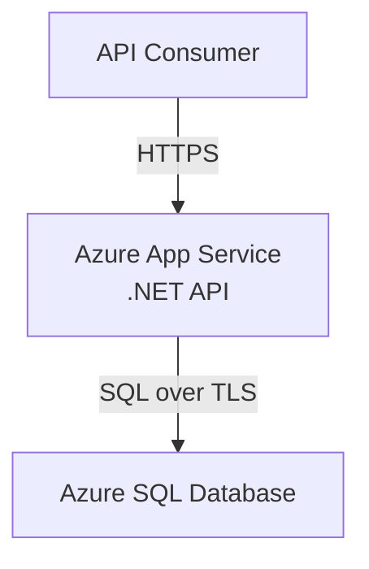

# Deployment

## 1. Overview

The Order Management API supports local development through .NET Aspire and cloud deployment to Microsoft Azure.

The initial cloud architecture uses:

- Azure App Service
- Azure SQL Database
- GitHub Actions

# 2. Local Development

## Prerequisites

The following tools are required:

- .NET SDK
- Docker Desktop
- Git
- GitHub account

.NET Aspire requires the appropriate .NET SDK and local container runtime.

## Running Locally

Clone the repository:

```bash
git clone <repository-url>
cd OrderManagement
```

Run the Aspire AppHost:
```bash
dotnet run --project src/OrderManagement.AppHost
```

The Aspire dashboard provides access to:

- API
- SQL Server
- Logs
- Resource health
- Application telemetry

# 3. Local Database

SQL Server runs as a container during local development.

The database schema is managed using Entity Framework Core migrations.

Apply migrations using the configured development process.

The application should be able to initialize a new local database without requiring a manually installed SQL Server instance.

# 4. CI/CD

GitHub Actions automates the build and validation process.

The pipeline performs:


Pull requests run the validation stages.

Deployments are performed from the main branch after successful validation.

# 5. Azure Architecture

The initial cloud deployment consists of:


# 6. Azure App Service

The ASP.NET Core API is hosted in Azure App Service.

Application configuration is provided through App Service configuration settings.

The application must not contain production connection strings or secrets in source control.

# 7. Azure SQL Database

Azure SQL Database hosts the production database.

Database migrations must be applied in a controlled deployment process.

The application uses a dedicated database connection string provided through Azure configuration.

# 8. Configuration

Configuration values are separated from application code.

Examples include:
```text
ConnectionStrings__OrderManagement
```

Environment-specific configuration must not be committed to the repository.

# 9. Secrets

Secrets must never be committed to Git. If available, enable Secret Push Protection

For the demonstration environment, Azure App Service configuration may be used for non-complex secrets.

For a production implementation, Azure Key Vault should be considered.

# 10. Deployment Process

The deployment process is:

1. Developer creates a pull request.
1. GitHub Actions builds the solution.
1. Unit tests are executed.
1. Integration tests are executed.
1. Pull request is reviewed.
1. Changes are merged into main.
1. GitHub Actions publishes the application.
1. Application is deployed to Azure App Service.
1. Database migrations are applied using the defined deployment strategy.
1. Application health is verified.

## 11. Health Check

The application exposes a health check endpoint at:
```http
GET /api/health
```

Expected response when healthy:
```http
200 OK
```

```json
{
  "status": "Healthy",
  "checks": {
    "Database": {
      "status": "Healthy"
    }
  }
}
```

### Health Check Implementation

The health check endpoint is implemented using .NET's built-in `HealthChecks` middleware.

Configuration:
- The `Microsoft.Extensions.Diagnostics.HealthChecks` package provides the health check infrastructure
- .NET Aspire includes built-in health checks for SQL Server connectivity
- The AppHost (AppHost.cs) configures health checks for the API service and SQL Server resource

### Checked Dependencies

The health check verifies:
- **Database connectivity**: Whether the SQL Server database is reachable and responsive
- **Application startup**: Whether the application has completed startup successfully

### Local Development with Aspire

.NET Aspire automatically provides health checks for:
- The Order Management API
- SQL Server resource
- Resource orchestration status

Health status is visible in the Aspire dashboard at `http://localhost:15000` (or similar port).

### Production Deployment

In Azure App Service:
- The health endpoint is used by Azure load balancers to verify application health
- Azure monitors the `/api/health` endpoint to determine if the instance should receive traffic
- Failed health checks trigger automated recovery actions (restart, replacement)

### Extensibility

Additional health checks can be added in the future:
- External API dependencies (payment processors, shipping providers)
- Cache health (if Redis is introduced)
- File storage health (if blob storage is added)

Currently, only database connectivity is checked to keep the scope aligned with the project goals.

# 12. Rollback

Application deployments should be recoverable through the previous deployment artifact.

Database changes must be designed carefully because database rollback may not always be safely reversible.

For this demonstration project, rollback procedures are intentionally simplified.

# 13. Production Considerations

The demonstration environment intentionally uses a small Azure footprint.

A production deployment could introduce:

* Azure Key Vault
* Managed Identity
* Application Insights
* Private networking
* Azure API Management
* WAF
* Backup and disaster recovery
* Deployment slots
* Infrastructure as Code

These capabilities are outside the current project scope.
